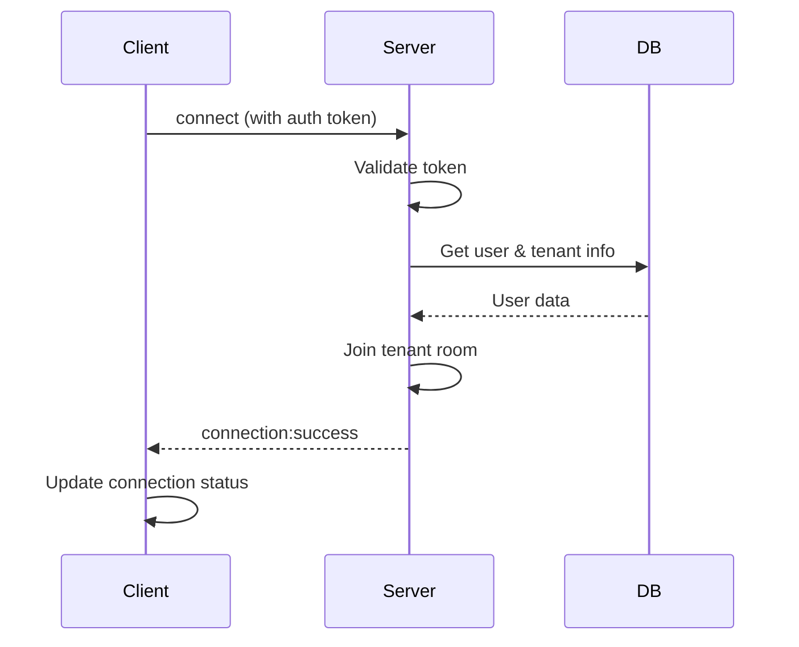
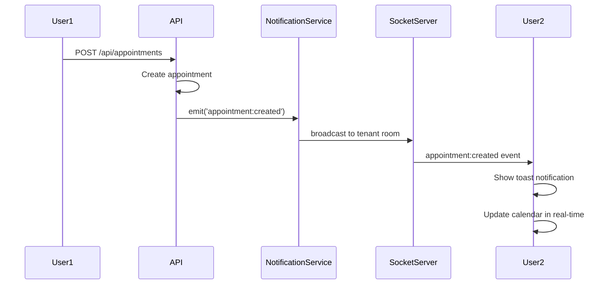
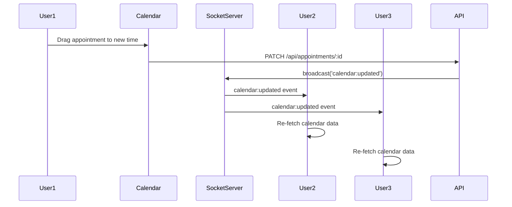

# 🔔 Fase 5: Sistema de Notificaciones en Tiempo Real

## 📋 Información General

**Versión:** v1.11.0  
**Fecha Inicio:** 2025-11-12  
**Estado:** En Implementación  
**Branch:** `feature/fase5-realtime-notifications`

## 🎯 Objetivo

Implementar un sistema completo de notificaciones en tiempo real que permita:
- Sincronización en vivo entre múltiples usuarios
- Notificaciones instantáneas de cambios en el calendario
- Panel de notificaciones unificado
- Preferencias personalizadas por usuario
- Coordinación multi-usuario en tiempo real

## 🏗️ Arquitectura del Sistema

### Stack Tecnológico

```
Frontend:
- Socket.io Client
- React Query (para gestión de estado)
- Zustand (para estado de notificaciones)
- Sonner (para toast notifications)
- Lucide React (iconos)

Backend:
- Socket.io Server
- Next.js API Routes
- Prisma ORM
- PostgreSQL
```

### Componentes Principales

#### 1. WebSocket Server (`/app/lib/socket/server.ts`)
- Gestión de conexiones WebSocket
- Autenticación de clientes
- Broadcasting de eventos
- Gestión de rooms por tenant

#### 2. Real-Time Notification Service (`/app/lib/services/realtimeNotificationService.ts`)
- Emisión de eventos en tiempo real
- Integración con NotificationLog
- Gestión de eventos de calendario
- Filtrado por rol y permisos

#### 3. WebSocket Client (`/app/lib/socket/client.ts`)
- Conexión persistente con el servidor
- Reconexión automática
- Manejo de eventos
- Estado de conexión

#### 4. Notification Store (`/app/lib/stores/notificationStore.ts`)
- Estado global de notificaciones
- Gestión de no leídas
- Histórico de notificaciones
- Preferencias de usuario

#### 5. UI Components
- `<NotificationCenter />`: Panel de notificaciones
- `<NotificationBell />`: Icono con contador
- `<NotificationToast />`: Toast para alertas inmediatas
- `<NotificationPreferences />`: Configuración de usuario

## 📊 Modelo de Datos

### Nuevas Tablas

#### UserNotificationPreferences
```prisma
model UserNotificationPreferences {
  id     String @id @default(cuid())
  userId String @unique
  user   User   @relation(fields: [userId], references: [id], onDelete: Cascade)

  // Preferencias de canal
  enablePushNotifications    Boolean @default(true)
  enableEmailNotifications   Boolean @default(true)
  enableSMSNotifications     Boolean @default(false)
  enableWhatsAppNotifications Boolean @default(false)

  // Preferencias de eventos
  notifyAppointmentCreated   Boolean @default(true)
  notifyAppointmentUpdated   Boolean @default(true)
  notifyAppointmentCancelled Boolean @default(true)
  notifyAppointmentReminder  Boolean @default(true)
  notifyScheduleChanges      Boolean @default(true)
  notifySystemAlerts         Boolean @default(true)

  // Preferencias de UI
  enableSounds               Boolean @default(true)
  enableDesktopNotifications Boolean @default(true)
  enableToastNotifications   Boolean @default(true)

  // Configuración de recordatorios
  reminderMinutesBefore      Int[]   @default([1440, 60]) // 24h y 1h antes

  tenantId  String
  tenant    Tenant   @relation(fields: [tenantId], references: [id], onDelete: Cascade)

  createdAt DateTime @default(now())
  updatedAt DateTime @updatedAt

  @@map("user_notification_preferences")
}
```

#### Actualización de NotificationLog
```prisma
model NotificationLog {
  // ... campos existentes ...
  
  // Nuevos campos para notificaciones en tiempo real
  isRealtime    Boolean @default(false) // Si fue enviada por WebSocket
  broadcastTo   String? // 'all', 'role:ADMIN', 'user:userId', 'branch:branchId'
  eventType     String? // 'appointment:created', 'calendar:updated', etc.
  eventData     String? @db.Text // JSON con datos del evento
  
  // ... resto de campos ...
}
```

## 🔄 Flujo de Eventos

### 1. Conexión WebSocket



### 2. Creación de Cita (Evento en Tiempo Real)



### 3. Sincronización de Calendario



## 📡 Eventos WebSocket

### Eventos del Servidor → Cliente

| Evento | Descripción | Payload |
|--------|-------------|---------|
| `connection:success` | Conexión establecida | `{ userId, tenantId, timestamp }` |
| `notification:new` | Nueva notificación | `{ id, type, message, data }` |
| `appointment:created` | Cita creada | `{ appointment, createdBy }` |
| `appointment:updated` | Cita actualizada | `{ appointment, updatedBy, changes }` |
| `appointment:deleted` | Cita eliminada | `{ appointmentId, deletedBy }` |
| `appointment:rescheduled` | Cita reprogramada | `{ appointment, oldTime, newTime }` |
| `calendar:refresh` | Refrescar calendario | `{ reason, affectedDates }` |
| `schedule:updated` | Horario actualizado | `{ professionalId, schedule }` |
| `user:online` | Usuario conectado | `{ userId, name, role }` |
| `user:offline` | Usuario desconectado | `{ userId }` |

### Eventos del Cliente → Servidor

| Evento | Descripción | Payload |
|--------|-------------|---------|
| `notification:read` | Marcar como leída | `{ notificationId }` |
| `notification:read:all` | Marcar todas como leídas | `{}` |
| `calendar:viewing` | Usuario viendo fecha | `{ date, viewType }` |
| `appointment:editing` | Usuario editando cita | `{ appointmentId }` |
| `presence:update` | Actualizar presencia | `{ status: 'online' \| 'away' }` |

## 🎨 Componentes UI

### NotificationBell
- Icono de campana en la navbar
- Badge con contador de no leídas
- Dropdown con últimas 5 notificaciones
- Botón "Ver todas" → abre NotificationCenter

### NotificationCenter
- Modal/Panel lateral con todas las notificaciones
- Filtros: Todas / No leídas / Por tipo
- Búsqueda de notificaciones
- Paginación infinita
- Acciones: Marcar leída, Eliminar
- Navegación a la entidad relacionada (cita, cliente, etc.)

### NotificationToast
- Toast temporal para notificaciones instantáneas
- Diferentes variantes: info, success, warning, error
- Sonido opcional (configurable)
- Acción rápida (ej: "Ver cita")
- Auto-dismiss después de 5 segundos

### NotificationPreferences
- Configuración de preferencias por canal
- Activar/desactivar tipos de notificaciones
- Configurar horarios de notificación
- Probar notificaciones
- Resetear a valores por defecto

## 🔐 Seguridad

### Autenticación WebSocket
```typescript
io.use(async (socket, next) => {
  const token = socket.handshake.auth.token;
  
  try {
    const session = await getSession({ token });
    if (!session?.user) {
      return next(new Error('Unauthorized'));
    }
    
    socket.data.userId = session.user.id;
    socket.data.tenantId = session.user.tenantId;
    socket.data.role = session.user.role;
    
    next();
  } catch (error) {
    next(new Error('Authentication failed'));
  }
});
```

### Autorización por Rooms
- Cada tenant tiene su propio room
- Los usuarios solo reciben eventos de su tenant
- Eventos filtrados por rol (ADMIN ve todo, PROFESSIONAL solo sus citas)

### Rate Limiting
- Máximo 100 eventos por minuto por usuario
- Desconexión automática si se excede el límite
- Logs de intentos sospechosos

## 📱 Soporte Multi-Dispositivo

### Sincronización entre Dispositivos
- Un usuario puede tener múltiples conexiones activas
- Los eventos se envían a todos los dispositivos del usuario
- Estado de "leído" se sincroniza entre dispositivos

### Notificaciones Offline
- Las notificaciones se guardan en NotificationLog
- Al reconectar, se envían las notificaciones perdidas
- Cliente verifica última notificación recibida

## 🧪 Testing

### Unit Tests
- `notificationService.test.ts`
- `socketServer.test.ts`
- `notificationStore.test.ts`

### Integration Tests
- Conexión y autenticación WebSocket
- Broadcasting de eventos
- Filtrado por tenant y rol

### E2E Tests
- Flujo completo de creación de cita → notificación
- Sincronización entre múltiples usuarios
- Preferencias de notificación

## 📈 Métricas y Monitoreo

### Métricas a Rastrear
- Conexiones activas por tenant
- Eventos enviados por segundo
- Latencia promedio de eventos
- Tasa de reconexiones
- Notificaciones no leídas por usuario

### Logs
```typescript
{
  timestamp: '2025-11-12T10:30:00Z',
  event: 'appointment:created',
  userId: 'user_123',
  tenantId: 'tenant_abc',
  socketId: 'socket_xyz',
  latency: 45, // ms
  success: true
}
```

## 🚀 Plan de Implementación

### Fase 5.1: Core Infrastructure (Días 1-2)
- ✅ Instalar Socket.io y dependencias
- ✅ Configurar WebSocket server
- ✅ Implementar autenticación y rooms
- ✅ Crear NotificationService real-time

### Fase 5.2: Database & API (Día 3)
- ✅ Migración: UserNotificationPreferences
- ✅ Actualizar NotificationLog
- ✅ API endpoints para preferencias
- ✅ API endpoints para historial de notificaciones

### Fase 5.3: Frontend Core (Días 4-5)
- ✅ WebSocket client hook (useSocket)
- ✅ Notification store (Zustand)
- ✅ NotificationBell component
- ✅ Toast system integration

### Fase 5.4: Advanced UI (Días 6-7)
- ✅ NotificationCenter component
- ✅ NotificationPreferences page
- ✅ Notification history con filtros
- ✅ Sonidos y animaciones

### Fase 5.5: Calendar Integration (Día 8)
- ✅ Real-time calendar sync
- ✅ Conflict detection
- ✅ Multi-user editing indicators
- ✅ Live presence indicators

### Fase 5.6: Testing & Polish (Días 9-10)
- ✅ Tests unitarios y de integración
- ✅ Performance optimization
- ✅ Documentation completa
- ✅ Bug fixes y refinamiento

## 📚 Documentación de API

### REST Endpoints

#### GET `/api/notifications`
Obtener notificaciones del usuario

**Query Parameters:**
- `page` (number): Página actual
- `limit` (number): Notificaciones por página
- `unread` (boolean): Solo no leídas
- `type` (string): Filtrar por tipo

**Response:**
```json
{
  "notifications": [
    {
      "id": "notif_123",
      "type": "appointment:created",
      "message": "Nueva cita: Juan Pérez - Corte de Cabello",
      "data": {
        "appointmentId": "apt_456",
        "clientName": "Juan Pérez",
        "serviceName": "Corte de Cabello",
        "startTime": "2025-11-15T10:00:00Z"
      },
      "isRead": false,
      "createdAt": "2025-11-12T09:30:00Z"
    }
  ],
  "pagination": {
    "total": 45,
    "page": 1,
    "pages": 5
  }
}
```

#### PATCH `/api/notifications/:id/read`
Marcar notificación como leída

#### POST `/api/notifications/read-all`
Marcar todas como leídas

#### GET `/api/notifications/preferences`
Obtener preferencias del usuario

#### PATCH `/api/notifications/preferences`
Actualizar preferencias

**Body:**
```json
{
  "enablePushNotifications": true,
  "notifyAppointmentCreated": true,
  "enableSounds": false,
  "reminderMinutesBefore": [1440, 60, 15]
}
```

### WebSocket Events API

Ver sección "Eventos WebSocket" arriba para la lista completa.

## 🎓 Guía de Uso

### Para Desarrolladores

#### Emitir un Evento en Tiempo Real
```typescript
import { realtimeNotificationService } from '@/lib/services/realtimeNotificationService';

// Después de crear una cita
await realtimeNotificationService.broadcastAppointmentCreated(
  appointment,
  session.user.id
);
```

#### Escuchar Eventos en el Cliente
```typescript
import { useSocket } from '@/hooks/useSocket';

function MyComponent() {
  const { on, off } = useSocket();
  
  useEffect(() => {
    const handler = (data) => {
      console.log('Nueva cita:', data);
      // Actualizar UI
    };
    
    on('appointment:created', handler);
    
    return () => off('appointment:created', handler);
  }, [on, off]);
}
```

### Para Usuarios Finales

#### Configurar Notificaciones
1. Ir a Configuración → Notificaciones
2. Activar/desactivar canales deseados
3. Seleccionar tipos de eventos a recibir
4. Configurar horarios de recordatorios
5. Guardar cambios

#### Ver Notificaciones
1. Click en el icono de campana (navbar)
2. Ver últimas notificaciones
3. Click en "Ver todas" para historial completo
4. Filtrar por tipo o buscar
5. Click en una notificación para ir a la entidad relacionada

## 🐛 Troubleshooting

### WebSocket no conecta
```bash
# Verificar que el servidor está corriendo
curl http://localhost:3000/api/health

# Verificar logs del servidor
docker logs citaplanner-app

# Verificar configuración de CORS
# En next.config.js debe permitir WebSocket
```

### Notificaciones no aparecen
1. Verificar que el usuario tiene preferencias habilitadas
2. Comprobar que está conectado al WebSocket
3. Verificar permisos y filtros por rol
4. Revisar logs en consola del navegador

### Performance Issues
1. Limitar eventos emitidos (usar debounce)
2. Implementar throttling en el servidor
3. Reducir tamaño de payload
4. Implementar paginación en NotificationCenter

## 📝 Notas de Desarrollo

### Consideraciones Importantes
- Socket.io debe correr en el mismo proceso que Next.js
- Usar Redis para escalado horizontal (futuro)
- Implementar heartbeat para mantener conexiones vivas
- Manejar reconexiones automáticas en el cliente
- Guardar todas las notificaciones en DB (no solo en memoria)

### Optimizaciones
- Batching de eventos (agrupar múltiples eventos)
- Compresión de payload (gzip)
- Lazy loading de notificaciones antiguas
- Caché de preferencias de usuario

## 🔄 Migraciones

```bash
# Crear migración
npx prisma migrate dev --name add_realtime_notifications

# Aplicar en producción
npx prisma migrate deploy
```

## 🎉 Resultado Esperado

Al finalizar Fase 5, CitaPlanner tendrá:
- ✅ Sistema de notificaciones en tiempo real completamente funcional
- ✅ Sincronización instantánea del calendario entre usuarios
- ✅ Panel de notificaciones completo y configurable
- ✅ Preferencias personalizadas por usuario
- ✅ Coordinación multi-usuario en tiempo real
- ✅ Mejor experiencia de usuario con feedback inmediato
- ✅ Base sólida para futuras funcionalidades en tiempo real

## 📊 Métricas de Éxito
- Latencia < 100ms para eventos en tiempo real
- 99.9% de uptime del WebSocket server
- 0 notificaciones perdidas
- < 1% de tasa de errores
- Feedback positivo de usuarios sobre la experiencia en tiempo real

---

**Versión:** 1.0.0  
**Última Actualización:** 2025-11-12  
**Autor:** CitaPlanner Team
