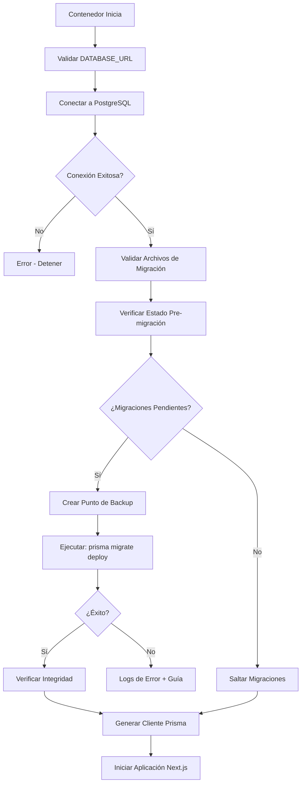

# 🔄 Sistema de Migraciones Automáticas de Prisma

## 📋 Índice

- [Visión General](#visión-general)
- [¿Cómo Funciona?](#cómo-funciona)
- [Proceso en Cada Deployment](#proceso-en-cada-deployment)
- [Logs y Monitoreo](#logs-y-monitoreo)
- [Casos de Uso Comunes](#casos-de-uso-comunes)
- [Troubleshooting](#troubleshooting)
- [Comandos Útiles](#comandos-útiles)
- [Preguntas Frecuentes](#preguntas-frecuentes)

---

## Visión General

CitaPlanner implementa un **sistema automático de migraciones de base de datos** que garantiza que tu esquema de base de datos esté siempre sincronizado con el código en cada deployment, **sin intervención manual**.

### ✨ Características Principales

- ✅ **100% Automático**: Las migraciones se ejecutan automáticamente en cada deployment
- ✅ **Validación Pre-migración**: Verifica el estado de la BD antes de aplicar cambios
- ✅ **Validación Post-migración**: Confirma que las migraciones se aplicaron correctamente
- ✅ **Logs Detallados**: Información completa de cada paso del proceso
- ✅ **Manejo de Errores Robusto**: Detección y guía de recuperación ante fallos
- ✅ **Idempotente**: Seguro ejecutar múltiples veces
- ✅ **Sin Downtime**: Las migraciones se aplican antes de iniciar la aplicación

---

## ¿Cómo Funciona?

El sistema está implementado en el archivo `docker-entrypoint.sh` y se ejecuta automáticamente cuando el contenedor inicia.

### Flujo de Ejecución



---

## Proceso en Cada Deployment

### 🔍 Paso 1: Validación de Archivos de Migración

El sistema verifica que los archivos de migración estén disponibles en `prisma/migrations/`.

```bash
[2025-10-15 10:30:00] ℹ️  Validando archivos de migración...
[2025-10-15 10:30:00] ℹ️  📁 Encontradas 15 migraciones en el directorio
[2025-10-15 10:30:00] ✅ Archivos de migración disponibles
```

### 🔍 Paso 2: Verificación de Estado Pre-migración

Se ejecuta `prisma migrate status` para determinar si hay migraciones pendientes.

**Posibles resultados:**

1. **Migraciones pendientes** → Continuar con aplicación
2. **BD actualizada** → Saltar aplicación de migraciones
3. **Migración fallida anterior** → Requiere intervención manual
4. **Esquema desincronizado** → Intentar sincronizar

```bash
[2025-10-15 10:30:01] ℹ️  Verificando estado actual de migraciones...
[2025-10-15 10:30:02] ℹ️  📋 Migraciones pendientes detectadas - se aplicarán automáticamente
```

### 📍 Paso 3: Creación de Punto de Backup

Se crea una marca temporal para referencia (informativo).

```bash
[2025-10-15 10:30:03] ℹ️  Creando punto de backup de migraciones...
[2025-10-15 10:30:03] ℹ️  📍 Punto de backup: migration_backup_1729000203
```

### 🚀 Paso 4: Aplicación de Migraciones

Se ejecuta `prisma migrate deploy` que aplica todas las migraciones pendientes.

```bash
[2025-10-15 10:30:04] ℹ️  Ejecutando: prisma migrate deploy

Prisma schema loaded from prisma/schema.prisma
Datasource "db": PostgreSQL database "citaplanner-db"

3 migrations found in prisma/migrations

Applying migration `20250115_add_branch_professionals`
Applying migration `20250115_add_schedules_table`
Applying migration `20250115_add_reports_views`

The following migrations have been applied:

migrations/
  └─ 20250115_add_branch_professionals/
      └─ migration.sql
  └─ 20250115_add_schedules_table/
      └─ migration.sql
  └─ 20250115_add_reports_views/
      └─ migration.sql

[2025-10-15 10:30:15] ✅ Migraciones aplicadas correctamente
```

### ✅ Paso 5: Verificación de Integridad

Se confirma que el esquema esté completamente sincronizado.

```bash
[2025-10-15 10:30:16] ℹ️  Verificando integridad de la base de datos post-migración...
[2025-10-15 10:30:17] ✅ Base de datos sincronizada correctamente
```

### 📊 Estado Final

Se muestra un resumen del estado de la base de datos:

```bash
[2025-10-15 10:30:18] ℹ️  Estado final de migraciones:

Database schema is up to date!

════════════════════════════════════════════════════════════════
✅ MIGRACIONES COMPLETADAS EXITOSAMENTE
════════════════════════════════════════════════════════════════

Tu base de datos está sincronizada con el esquema de Prisma.
La aplicación está lista para iniciar.
```

---

## Logs y Monitoreo

### 📁 Archivos de Log

El sistema genera logs en `/tmp/` para debugging:

| Archivo | Contenido |
|---------|-----------|
| `/tmp/migrate-status-pre.log` | Estado de migraciones antes de aplicar |
| `/tmp/migrate-deploy.log` | Output completo de `migrate deploy` |
| `/tmp/migrate-status-post.log` | Estado después de aplicar migraciones |

### 📊 Visualización de Logs en Easypanel

Para ver los logs en tiempo real:

1. Ve a tu aplicación en Easypanel
2. Navega a la pestaña "Logs"
3. Busca las secciones con:
   - `🔄 SISTEMA AUTOMÁTICO DE MIGRACIONES`
   - `✅ MIGRACIONES COMPLETADAS EXITOSAMENTE`

---

## Casos de Uso Comunes

### ✅ Caso 1: Deployment Normal (Con Migraciones Pendientes)

**Escenario:** Hiciste cambios al schema.prisma y creaste migraciones

```bash
# En desarrollo local
npx prisma migrate dev --name add_new_column
git add .
git commit -m "feat: add new column to users table"
git push origin main
```

**Resultado en Deployment:**
```
✅ Sistema detecta 1 migración pendiente
✅ Aplica la migración automáticamente
✅ Aplicación inicia con esquema actualizado
```

### ✅ Caso 2: Deployment Sin Cambios

**Escenario:** Deployment sin cambios en base de datos

**Resultado:**
```
[2025-10-15 10:30:00] ✅ No hay migraciones pendientes - base de datos actualizada
[2025-10-15 10:30:00] ✅ Base de datos ya actualizada - saltando aplicación de migraciones
```

### ✅ Caso 3: Múltiples Migraciones Acumuladas

**Escenario:** Varias migraciones creadas entre deployments

**Resultado:**
```
✅ Sistema detecta 5 migraciones pendientes
✅ Aplica todas las migraciones en orden
✅ Verifica integridad final
✅ Aplicación lista para usar
```

---

## Troubleshooting

### ❌ Error: Migración Fallida

**Síntomas:**
```
❌ ERROR AL APLICAR MIGRACIONES (Exit Code: 1)

Causas comunes:
  ❌ Conflictos en el esquema de la base de datos
  ❌ Migraciones incompatibles con datos existentes
  ❌ Constraints violados (foreign keys, unique, etc.)
```

**Solución:**

1. **Revisar los logs** para identificar la migración específica que falló:
   ```bash
   docker exec -it <container-name> cat /tmp/migrate-deploy.log
   ```

2. **Verificar el estado de migraciones:**
   ```bash
   docker exec -it <container-name> npx prisma migrate status
   ```

3. **Analizar la migración fallida:**
   ```bash
   # Ver el contenido de la migración
   cat prisma/migrations/<migration-name>/migration.sql
   ```

4. **Opciones de recuperación:**

   **Opción A: Marcar como aplicada** (si la migración ya se aplicó parcialmente)
   ```bash
   docker exec -it <container-name> npx prisma migrate resolve --applied <migration-name>
   ```

   **Opción B: Marcar como revertida** (si deseas descartar la migración)
   ```bash
   docker exec -it <container-name> npx prisma migrate resolve --rolled-back <migration-name>
   ```

   **Opción C: Corregir datos y reintentar**
   - Corrige los datos en la BD que causan el conflicto
   - Reinicia el contenedor para reintentar

---

### ❌ Error: Estado Inconsistente

**Síntomas:**
```
❌ ESTADO DE MIGRACIONES INCONSISTENTE

La base de datos tiene migraciones en estado fallido.
Esto requiere intervención manual.
```

**Solución:**

1. **Acceder al contenedor:**
   ```bash
   docker exec -it <container-name> sh
   ```

2. **Ver estado detallado:**
   ```bash
   npx prisma migrate status
   ```

3. **Resolver migraciones en estado fallido:**
   ```bash
   # Ver opciones disponibles
   npx prisma migrate resolve --help
   
   # Marcar migración específica como aplicada o revertida
   npx prisma migrate resolve --applied "20250115_migration_name"
   ```

4. **Reiniciar el contenedor después de resolver:**
   ```bash
   # En Easypanel: Restart application
   # O en Docker:
   docker restart <container-name>
   ```

---

### ⚠️ Warning: Integridad con Advertencias

**Síntomas:**
```
⚠️  Verificación de integridad mostró advertencias
   La aplicación continuará, pero revisa los logs
```

**Qué Significa:**
- Las migraciones se aplicaron, pero el estado final muestra pequeñas inconsistencias
- La aplicación seguirá funcionando
- Se recomienda revisar para asegurar que todo está correcto

**Solución:**
1. Revisa el log post-migración:
   ```bash
   docker exec -it <container-name> cat /tmp/migrate-status-post.log
   ```

2. Si es necesario, ejecuta una sincronización manual:
   ```bash
   docker exec -it <container-name> npx prisma db push --skip-generate
   ```

---

## Comandos Útiles

### Verificar Estado de Migraciones

```bash
# Desde el contenedor
docker exec -it <container-name> npx prisma migrate status

# Desde el host (si tienes Node.js)
cd app && npm run migrate:status
```

### Ver Logs de Migración

```bash
# Log pre-migración
docker exec -it <container-name> cat /tmp/migrate-status-pre.log

# Log de deploy
docker exec -it <container-name> cat /tmp/migrate-deploy.log

# Log post-migración
docker exec -it <container-name> cat /tmp/migrate-status-post.log
```

### Aplicar Migraciones Manualmente

```bash
# Solo si necesitas ejecutar manualmente (normalmente no es necesario)
docker exec -it <container-name> npx prisma migrate deploy
```

### Resolver Migraciones Fallidas

```bash
# Ver ayuda
docker exec -it <container-name> npx prisma migrate resolve --help

# Marcar como aplicada
docker exec -it <container-name> npx prisma migrate resolve --applied <migration_name>

# Marcar como revertida
docker exec -it <container-name> npx prisma migrate resolve --rolled-back <migration_name>
```

### Regenerar Cliente Prisma

```bash
docker exec -it <container-name> npx prisma generate
```

### Abrir Prisma Studio (Para debugging)

```bash
# En desarrollo local
npm run db:studio

# Abre en http://localhost:5555
```

---

## Preguntas Frecuentes

### ❓ ¿Las migraciones se ejecutan en cada deployment?

**Sí**, pero son **idempotentes**. Si no hay migraciones pendientes, el sistema lo detecta y las salta inmediatamente, sin tiempo de espera innecesario.

### ❓ ¿Qué sucede si una migración falla?

El contenedor **no inicia** la aplicación. El sistema:
1. Muestra logs detallados del error
2. Guarda logs en archivos para análisis
3. Proporciona comandos de recuperación específicos
4. Espera intervención manual para resolver

Esto previene que la aplicación inicie con un esquema inconsistente.

### ❓ ¿Puedo desactivar las migraciones automáticas?

**No se recomienda**, pero técnicamente puedes comentar la llamada a `run_migrations` en `docker-entrypoint.sh`. Sin embargo, esto puede causar errores de sincronización entre código y base de datos.

### ❓ ¿Cómo sé si las migraciones se ejecutaron correctamente?

Busca en los logs de Easypanel la sección:
```
✅ MIGRACIONES COMPLETADAS EXITOSAMENTE
```

También puedes verificar manualmente:
```bash
docker exec -it <container> npx prisma migrate status
```

### ❓ ¿Las migraciones crean backups automáticos?

El sistema **no crea backups automáticos** de datos. Sin embargo:
- Easypanel tiene configurado backups automáticos del volumen de PostgreSQL
- Se recomienda tener tu propio schedule de backups para producción

### ❓ ¿Qué pasa con los datos existentes?

Las migraciones de Prisma están diseñadas para:
- **Preservar datos existentes** cuando sea posible
- **Aplicar transformaciones** definidas en la migración
- **Fallar seguramente** si hay conflictos que requieren intervención

**Importante:** Siempre prueba migraciones destructivas en staging primero.

### ❓ ¿Cómo creo una nueva migración?

En tu entorno de desarrollo local:

```bash
# 1. Modifica prisma/schema.prisma
# 2. Crea la migración
npx prisma migrate dev --name descripcion_del_cambio

# 3. Commit los cambios
git add prisma/migrations/
git commit -m "feat: add new migration"

# 4. Push a GitHub
git push origin main

# 5. Las migraciones se aplicarán automáticamente en el próximo deployment
```

### ❓ ¿Puedo revertir una migración?

Prisma **no soporta rollbacks automáticos**. Para revertir:

1. **Opción 1: Crear migración de reversión**
   ```bash
   # Modifica schema.prisma para revertir los cambios
   npx prisma migrate dev --name revert_previous_change
   ```

2. **Opción 2: Restaurar desde backup**
   - Restaura el volumen de PostgreSQL desde backup de Easypanel
   - Revierte el código a un commit anterior

---

## Scripts de NPM Agregados

Los siguientes scripts están disponibles en `package.json`:

```json
{
  "scripts": {
    "migrate:deploy": "prisma migrate deploy",
    "migrate:status": "prisma migrate status",
    "migrate:resolve": "prisma migrate resolve",
    "prisma:generate": "prisma generate",
    "db:push": "prisma db push",
    "db:studio": "prisma studio"
  }
}
```

### Uso:

```bash
# Ver estado de migraciones
npm run migrate:status

# Aplicar migraciones manualmente
npm run migrate:deploy

# Regenerar cliente Prisma
npm run prisma:generate

# Abrir Prisma Studio (desarrollo)
npm run db:studio
```

---

## Mejores Prácticas

### ✅ DO's

1. ✅ **Prueba migraciones en staging** antes de producción
2. ✅ **Revisa logs de deployment** para confirmar éxito
3. ✅ **Mantén backups regulares** de la base de datos
4. ✅ **Usa nombres descriptivos** para migraciones
5. ✅ **Documenta cambios complejos** en el PR

### ❌ DON'Ts

1. ❌ **No hagas cambios directos** en la BD sin migración
2. ❌ **No edites migraciones ya aplicadas** en producción
3. ❌ **No ignores errores de migración** - resuélvelos inmediatamente
4. ❌ **No saltes pasos de testing** en staging
5. ❌ **No modifiques docker-entrypoint.sh** sin documentar

---

## Arquitectura Técnica

### Componentes Clave

```
docker-entrypoint.sh
├── validate_database_url()          # Validación de DATABASE_URL
├── check_database_connection_psql() # Verificación de conectividad
├── validate_migration_files()       # Validación de archivos
├── check_migration_status()         # Estado pre-migración
├── create_migration_backup_point()  # Punto de backup
├── run_migrations()                 # Aplicación de migraciones
│   ├── Paso 1: Validar archivos
│   ├── Paso 2: Verificar estado
│   ├── Paso 3: Backup point
│   ├── Paso 4: Aplicar migraciones
│   └── Paso 5: Verificar integridad
├── verify_migration_integrity()     # Validación post-migración
└── generate_prisma_client()         # Generación de cliente
```

### Flujo de Datos

```
Easypanel Deployment
        ↓
Docker Container Start
        ↓
docker-entrypoint.sh
        ↓
Validaciones de Conexión
        ↓
Sistema de Migraciones ← prisma/migrations/
        ↓
PostgreSQL (citaplanner-db)
        ↓
Verificación de Integridad
        ↓
Generación Cliente Prisma
        ↓
Inicio Next.js
```

---

## Soporte y Recursos

### 📚 Documentación Oficial

- [Prisma Migrate](https://www.prisma.io/docs/concepts/components/prisma-migrate)
- [Deployment Best Practices](https://www.prisma.io/docs/guides/deployment/deployment-guides)
- [Migration Troubleshooting](https://www.prisma.io/docs/guides/migrate/production-troubleshooting)

### 🔗 Enlaces Relacionados

- [CHANGELOG.md](./CHANGELOG.md) - Historial de cambios
- [DEPLOYMENT.md](./DEPLOYMENT.md) - Guía de deployment
- [TECHNICAL_GUIDE.md](./TECHNICAL_GUIDE.md) - Guía técnica completa

---

## Changelog del Sistema de Migraciones

| Versión | Fecha | Cambios |
|---------|-------|---------|
| v1.0.0 | 2025-10-15 | Sistema automático de migraciones implementado |
| | | - Validación pre/post migración |
| | | - Manejo robusto de errores |
| | | - Logs detallados |
| | | - Scripts de NPM agregados |

---

**Última actualización:** Octubre 15, 2025  
**Versión del documento:** 1.0.0  
**Autor:** CitaPlanner Team
