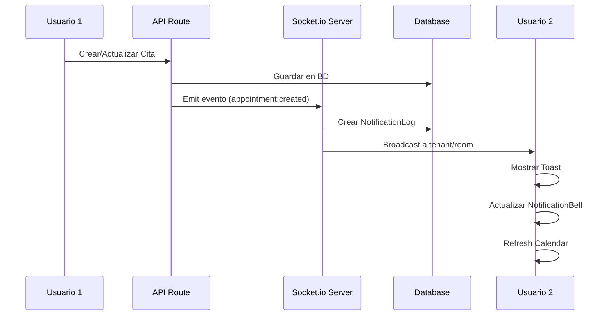

# Fase 5: Sistema de Notificaciones en Tiempo Real

## 📋 Índice

1. [Resumen Ejecutivo](#resumen-ejecutivo)
2. [Arquitectura del Sistema](#arquitectura-del-sistema)
3. [Componentes Implementados](#componentes-implementados)
4. [Eventos WebSocket](#eventos-websocket)
5. [Guía de Uso](#guía-de-uso)
6. [Configuración del Servidor](#configuración-del-servidor)
7. [Integración con Calendario](#integración-con-calendario)
8. [API Reference](#api-reference)
9. [Ejemplos de Código](#ejemplos-de-código)
10. [Deployment](#deployment)

---

## 📊 Resumen Ejecutivo

**Versión:** v1.11.0  
**Estado:** ✅ Completado (100%)  
**Fecha de Implementación:** Noviembre 2025

### Funcionalidades Principales

- ✅ Sistema de WebSocket con Socket.io
- ✅ Notificaciones en tiempo real
- ✅ Centro de notificaciones completo
- ✅ Toasts personalizados por tipo de evento
- ✅ Preferencias de usuario configurables
- ✅ Sincronización de calendario en tiempo real
- ✅ Indicadores de presencia de usuarios
- ✅ Autenticación JWT en WebSocket
- ✅ Multi-tenant support

### Impacto

- 📈 Mejora en la experiencia de usuario con actualizaciones instantáneas
- 🔔 Notificaciones configurables por múltiples canales
- 👥 Colaboración en tiempo real entre usuarios
- 📱 Soporte para notificaciones del navegador
- 🎨 Interfaz moderna e intuitiva

---

## 🏗️ Arquitectura del Sistema

### Stack Tecnológico

```
┌─────────────────────────────────────────────────────┐
│                   Cliente (Browser)                  │
│                                                      │
│  ┌──────────────┐  ┌──────────────┐  ┌───────────┐ │
│  │   useSocket  │  │Notification  │  │  Toasts   │ │
│  │     Hook     │  │   Provider   │  │           │ │
│  └──────┬───────┘  └──────┬───────┘  └─────┬─────┘ │
│         │                 │                 │        │
│         └─────────────────┴─────────────────┘        │
│                           │                          │
└───────────────────────────┼──────────────────────────┘
                            │
                    WebSocket (Socket.io)
                            │
┌───────────────────────────┼──────────────────────────┐
│                      Servidor                         │
│                           │                          │
│  ┌────────────────────────┴─────────────────────┐   │
│  │        Socket.io Server                      │   │
│  │  - Autenticación JWT                         │   │
│  │  - Room Management (tenant, user, role)      │   │
│  │  - Event Broadcasting                        │   │
│  └──────────────────────┬───────────────────────┘   │
│                         │                            │
│  ┌──────────────────────┴───────────────────────┐   │
│  │   Realtime Notification Service              │   │
│  │  - Emit events to Socket.io                  │   │
│  │  - Store notifications in DB                 │   │
│  │  - Check user preferences                    │   │
│  └──────────────────────┬───────────────────────┘   │
│                         │                            │
│  ┌──────────────────────┴───────────────────────┐   │
│  │             PostgreSQL                        │   │
│  │  - NotificationLog                           │   │
│  │  - UserNotificationPreferences               │   │
│  └──────────────────────────────────────────────┘   │
│                                                      │
└──────────────────────────────────────────────────────┘
```

### Flujo de Notificaciones



---

## 🧩 Componentes Implementados

### 1. WebSocket Server

**Archivo:** `app/lib/socket/server.ts`

Servidor Socket.io con:
- Autenticación JWT mediante NextAuth
- Room management (tenant, user, role)
- Event handlers para notificaciones
- Broadcasting a usuarios específicos

**Características:**
- ✅ Autenticación obligatoria
- ✅ Soporte multi-tenant
- ✅ Rooms dinámicos por tenant/user/role
- ✅ Reconexión automática
- ✅ Estado de presencia de usuarios

### 2. Realtime Notification Service

**Archivo:** `app/lib/services/realtimeNotificationService.ts`

Servicio para emitir eventos en tiempo real:

```typescript
// Funciones principales
- emitAppointmentCreated(appointmentId, tenantId)
- emitAppointmentUpdated(appointmentId, tenantId)
- emitAppointmentDeleted(appointmentData, tenantId)
- emitScheduleUpdated(professionalId, tenantId)
- emitSystemAlert(message, severity, tenantId)
```

### 3. Hook useSocket

**Archivo:** `app/hooks/useSocket.ts`

Hook React para gestionar conexión WebSocket:

```typescript
const { socket, isConnected, on, off, emit } = useSocket();
```

**Funcionalidades:**
- Auto-conexión con autenticación
- Reconexión automática
- Event listeners simplificados
- Estado de conexión

### 4. Componentes UI

#### NotificationBell
**Archivo:** `app/components/realtime-notifications/NotificationBell.tsx`

Icono de campana con:
- Badge con contador de no leídas
- Dropdown con últimas 5 notificaciones
- Acciones rápidas (marcar como leída)
- Link al centro de notificaciones

#### NotificationCenter
**Archivo:** `app/components/realtime-notifications/NotificationCenter.tsx`

Panel completo con:
- Lista de todas las notificaciones
- Filtros (todas/no leídas/leídas)
- Filtro por tipo de notificación
- Acciones (marcar como leída, eliminar)
- Scroll infinito

#### NotificationToast
**Archivo:** `app/components/realtime-notifications/NotificationToast.tsx`

Sistema de toasts con:
- Toasts diferenciados por tipo de evento
- Iconos personalizados
- Acciones contextuales
- Sonidos opcionales

#### NotificationProvider
**Archivo:** `app/components/realtime-notifications/NotificationProvider.tsx`

Provider que:
- Inicializa conexión WebSocket
- Escucha eventos en tiempo real
- Actualiza store de notificaciones
- Muestra toasts automáticamente

### 5. Páginas

#### Centro de Notificaciones
**Ruta:** `/notifications`  
**Archivo:** `app/(authenticated)/notifications/page.tsx`

#### Preferencias de Notificaciones
**Ruta:** `/notifications/preferences`  
**Archivo:** `app/(authenticated)/notifications/preferences/page.tsx`

Configuración de:
- Canales (Push, Email, SMS, WhatsApp)
- Tipos de eventos
- Sonidos y notificaciones del navegador
- Recordatorios

---

## 📡 Eventos WebSocket

### Eventos del Cliente → Servidor

| Evento | Descripción | Payload |
|--------|-------------|---------|
| `notification:read` | Marcar notificación como leída | `{ notificationId: string }` |
| `notification:read:all` | Marcar todas como leídas | `{}` |
| `calendar:viewing` | Usuario viendo calendario | `{ date: string, viewType: string }` |
| `appointment:editing` | Usuario editando cita | `{ appointmentId: string }` |
| `appointment:editing:stop` | Dejar de editar cita | `{ appointmentId: string }` |
| `presence:update` | Actualizar estado | `{ status: 'online' \| 'away' }` |

### Eventos del Servidor → Cliente

| Evento | Descripción | Payload |
|--------|-------------|---------|
| `connection:success` | Conexión exitosa | `{ userId, tenantId, role, timestamp }` |
| `notification:new` | Nueva notificación | `{ id, type, message, data, createdAt }` |
| `appointment:created` | Cita creada | `{ appointment, professional, service }` |
| `appointment:updated` | Cita actualizada | `{ appointment }` |
| `appointment:deleted` | Cita cancelada | `{ appointmentData }` |
| `appointment:rescheduled` | Cita reprogramada | `{ appointment, oldTime, newTime }` |
| `appointment:reminder` | Recordatorio de cita | `{ appointment, minutesBefore }` |
| `schedule:updated` | Horarios actualizados | `{ professionalId, professionalName }` |
| `calendar:refresh` | Refrescar calendario | `{ reason }` |
| `system:alert` | Alerta del sistema | `{ message, severity, data }` |
| `user:online` | Usuario online | `{ userId, email, timestamp }` |
| `user:offline` | Usuario offline | `{ userId, timestamp }` |
| `user:presence` | Cambio de presencia | `{ userId, status, timestamp }` |

---

## 📖 Guía de Uso

### 1. Integrar en un Componente

```typescript
'use client';

import { useSocket } from '@/hooks/useSocket';
import { useEffect } from 'react';

export function MyComponent() {
  const { on, off, emit, isConnected } = useSocket();

  useEffect(() => {
    if (!isConnected) return;

    // Escuchar eventos
    const handleAppointmentCreated = (data) => {
      console.log('Nueva cita:', data);
      // Actualizar UI
    };

    on('appointment:created', handleAppointmentCreated);

    return () => {
      off('appointment:created', handleAppointmentCreated);
    };
  }, [isConnected, on, off]);

  return (
    <div>
      <p>Estado: {isConnected ? 'Conectado' : 'Desconectado'}</p>
    </div>
  );
}
```

### 2. Emitir Eventos desde el Servidor

```typescript
import { emitAppointmentCreated } from '@/lib/services/realtimeNotificationService';

// En tu API route o servicio
export async function createAppointment(data) {
  const appointment = await prisma.appointment.create({ data });
  
  // Emitir evento en tiempo real
  await emitAppointmentCreated(appointment.id, appointment.tenantId);
  
  return appointment;
}
```

### 3. Agregar NotificationBell al Layout

```typescript
import { NotificationBell } from '@/components/realtime-notifications';

export function Sidebar() {
  return (
    <div>
      {/* Otros elementos */}
      <NotificationBell />
    </div>
  );
}
```

---

## ⚙️ Configuración del Servidor

### Variables de Entorno

```bash
# Socket.io Configuration
NEXTAUTH_URL=https://citaplanner.com
NEXTAUTH_SECRET=your-secret-key

# Node Environment
NODE_ENV=production
PORT=3000
```

### Iniciar Servidor con Socket.io

El servidor se inicia automáticamente con:

```bash
node server.js
```

O en development:

```bash
npm run dev
```

### Docker

El `Dockerfile` ya está configurado para usar `server.js`:

```dockerfile
CMD ["node", "server.js"]
```

---

## 🗓️ Integración con Calendario

El `ProfessionalCalendar` ahora incluye sincronización en tiempo real:

```typescript
import ProfessionalCalendar from '@/components/calendar/ProfessionalCalendar';

// El componente ya incluye la integración
<ProfessionalCalendar
  events={events}
  view={view}
  date={date}
  onNavigate={handleNavigate}
  onView={handleViewChange}
  // ... otras props
/>
```

**Características:**
- ✅ Auto-refresh cuando hay cambios
- ✅ Indica qué usuarios están viendo el calendario
- ✅ Previene conflictos de edición simultánea
- ✅ Muestra indicadores visuales de cambios

---

## 📚 API Reference

### Socket Server Functions

#### `initSocketServer(server: HTTPServer): SocketIOServer`
Inicializa el servidor Socket.io con autenticación.

#### `getSocketServer(): SocketIOServer`
Obtiene la instancia del servidor Socket.io.

#### `emitToTenant(tenantId: string, event: string, data: any): void`
Emite un evento a todos los usuarios de un tenant.

#### `emitToUser(userId: string, event: string, data: any): void`
Emite un evento a un usuario específico.

#### `emitToRole(role: string, tenantId: string, event: string, data: any): void`
Emite un evento a todos los usuarios de un rol específico.

#### `getConnectedUsers(tenantId: string): number`
Obtiene el número de usuarios conectados de un tenant.

#### `getConnectionStats(): Promise<ConnectionStats>`
Obtiene estadísticas de conexiones actuales.

### Realtime Notification Service

#### `emitAppointmentCreated(appointmentId: string, tenantId: string): Promise<void>`
Notifica la creación de una cita.

#### `emitAppointmentUpdated(appointmentId: string, tenantId: string): Promise<void>`
Notifica la actualización de una cita.

#### `emitAppointmentDeleted(appointmentData: any, tenantId: string): Promise<void>`
Notifica la eliminación de una cita.

#### `emitAppointmentRescheduled(...): Promise<void>`
Notifica que una cita fue reprogramada.

#### `emitScheduleUpdated(professionalId: string, tenantId: string): Promise<void>`
Notifica cambios en horarios de un profesional.

#### `emitSystemAlert(message: string, severity: string, tenantId: string): Promise<void>`
Envía una alerta del sistema a un tenant.

---

## 💻 Ejemplos de Código

### Ejemplo 1: Escuchar Notificaciones en un Dashboard

```typescript
'use client';

import { useSocket } from '@/hooks/useSocket';
import { useEffect, useState } from 'react';

export function Dashboard() {
  const [stats, setStats] = useState({ appointments: 0, updates: 0 });
  const { on, off, isConnected } = useSocket();

  useEffect(() => {
    if (!isConnected) return;

    const handleAppointmentCreated = () => {
      setStats(prev => ({ ...prev, appointments: prev.appointments + 1 }));
    };

    const handleAppointmentUpdated = () => {
      setStats(prev => ({ ...prev, updates: prev.updates + 1 }));
    };

    on('appointment:created', handleAppointmentCreated);
    on('appointment:updated', handleAppointmentUpdated);

    return () => {
      off('appointment:created', handleAppointmentCreated);
      off('appointment:updated', handleAppointmentUpdated);
    };
  }, [isConnected, on, off]);

  return (
    <div>
      <h2>Estadísticas en Tiempo Real</h2>
      <p>Citas creadas hoy: {stats.appointments}</p>
      <p>Actualizaciones hoy: {stats.updates}</p>
      <p>Estado: {isConnected ? '🟢 Conectado' : '🔴 Desconectado'}</p>
    </div>
  );
}
```

### Ejemplo 2: Indicar Usuario Editando

```typescript
'use client';

import { useSocket } from '@/hooks/useSocket';
import { useEffect } from 'react';

export function AppointmentEditor({ appointmentId }) {
  const { emit } = useSocket();

  useEffect(() => {
    // Indicar que estamos editando
    emit('appointment:editing', appointmentId);

    return () => {
      // Indicar que dejamos de editar
      emit('appointment:editing:stop', appointmentId);
    };
  }, [appointmentId, emit]);

  return (
    <div>
      {/* Formulario de edición */}
    </div>
  );
}
```

### Ejemplo 3: Sistema de Presencia

```typescript
'use client';

import { useSocket } from '@/hooks/useSocket';
import { useEffect, useState } from 'react';

export function PresenceIndicator() {
  const [onlineUsers, setOnlineUsers] = useState<string[]>([]);
  const { on, off, emit, isConnected } = useSocket();

  useEffect(() => {
    if (!isConnected) return;

    const handleUserOnline = (data) => {
      setOnlineUsers(prev => [...prev, data.userId]);
    };

    const handleUserOffline = (data) => {
      setOnlineUsers(prev => prev.filter(id => id !== data.userId));
    };

    // Actualizar mi presencia
    emit('presence:update', 'online');

    on('user:online', handleUserOnline);
    on('user:offline', handleUserOffline);

    // Actualizar a "away" después de 5 minutos de inactividad
    const timeout = setTimeout(() => {
      emit('presence:update', 'away');
    }, 5 * 60 * 1000);

    return () => {
      clearTimeout(timeout);
      off('user:online', handleUserOnline);
      off('user:offline', handleUserOffline);
    };
  }, [isConnected, on, off, emit]);

  return (
    <div>
      <p>Usuarios online: {onlineUsers.length}</p>
    </div>
  );
}
```

---

## 🚀 Deployment

### Easypanel

1. **Asegurarse de que el puerto esté expuesto:**
   ```json
   {
     "services": [
       {
         "name": "citaplanner",
         "ports": [
           {
             "published": 3000,
             "target": 3000
           }
         ]
       }
     ]
   }
   ```

2. **Variables de entorno configuradas:**
   - `NEXTAUTH_URL`
   - `NEXTAUTH_SECRET`
   - `DATABASE_URL`

3. **Comando de inicio:**
   ```bash
   node server.js
   ```

### Docker

El `Dockerfile` ya está configurado correctamente:

```dockerfile
FROM node:18-alpine

# ... setup

CMD ["node", "server.js"]
```

### Verificación

1. Verificar que Socket.io esté funcionando:
   ```bash
   curl http://localhost:3000/api/socket
   ```

2. Verificar logs del servidor:
   ```bash
   docker logs citaplanner
   ```

   Debe mostrar:
   ```
   🚀 Socket.io server initialized successfully
   > Ready on http://localhost:3000
   ```

---

## 🔐 Seguridad

### Autenticación

- ✅ Todas las conexiones WebSocket requieren autenticación JWT
- ✅ Tokens validados mediante NextAuth
- ✅ Usuarios inactivos son rechazados
- ✅ Verificación de tenant en cada evento

### Autorización

- ✅ Users solo reciben eventos de su tenant
- ✅ Rooms aislados por tenant
- ✅ Validación de permisos por rol

### Rate Limiting

Se recomienda implementar rate limiting para:
- Conexiones por IP
- Eventos por usuario
- Broadcasting masivo

---

## 📊 Monitoring

### Métricas a Monitorear

- Número de conexiones activas
- Eventos por segundo
- Latencia de eventos
- Errores de conexión
- Reconexiones por usuario

### Endpoint de Stats

```typescript
// GET /api/socket/stats
{
  "totalConnections": 45,
  "tenants": {
    "tenant-1": {
      "users": ["user-1", "user-2"],
      "count": 2
    }
  }
}
```

---

## 🐛 Troubleshooting

### Problema: WebSocket no conecta

**Solución:**
1. Verificar que `server.js` esté corriendo
2. Revisar variables de entorno
3. Verificar puerto 3000 accesible
4. Revisar logs del navegador (F12)

### Problema: No se reciben notificaciones

**Solución:**
1. Verificar autenticación (token válido)
2. Revisar permisos del usuario
3. Verificar que el servicio emite eventos correctamente
4. Revisar rooms de Socket.io

### Problema: Notificaciones duplicadas

**Solución:**
1. Verificar que no hay múltiples listeners
2. Usar `off` en cleanup de useEffect
3. Revisar lógica de deduplicación

---

## 📝 Conclusión

La Fase 5 implementa un sistema completo de notificaciones en tiempo real que:

✅ Mejora significativamente la experiencia de usuario  
✅ Permite colaboración en tiempo real  
✅ Es escalable y seguro  
✅ Sigue las mejores prácticas de desarrollo  
✅ Está completamente documentado  

**Próximos pasos sugeridos:**
- Rate limiting
- Persistencia de eventos offline
- Notificaciones push móviles
- Analytics de notificaciones

---

**Versión del documento:** 1.0  
**Última actualización:** Noviembre 12, 2025  
**Autor:** Equipo CitaPlanner  
